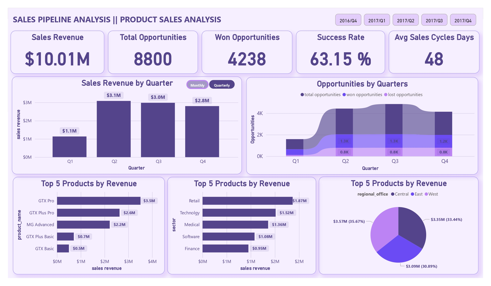
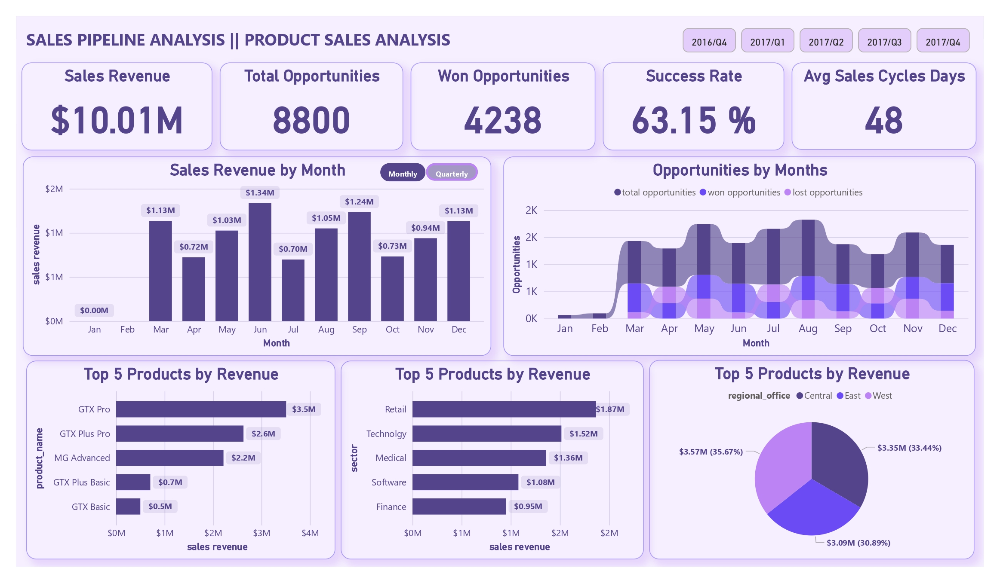

# 📊 Sales Pipeline Analysis Dashboard

## 🧠 About the Dashboard
The **Sales Pipeline Analysis Dashboard** provides an in-depth overview of sales performance, opportunities, and revenue distribution across products, regions, and sectors.  
It enables sales leaders and analysts to track the efficiency of their pipeline, identify top-performing products, and monitor trends across time.

- **Overview**

  
--

## 📌 Project Overview
This Power BI dashboard helps visualize the sales funnel—from opportunities generated to revenue realized—across different time frames (monthly and quarterly), regions, and sectors.

### 💼 Business Problem

> **"How can a company improve its sales conversion rate and revenue forecasting by analyzing opportunity stages, sales cycles, product performance, and regional trends?"**

This Power BI dashboard addresses critical business challenges by providing a clear view of the **sales pipeline performance**. It empowers stakeholders to:

- 🔍 Identify **top-performing products, sectors, and regions**.
- 📈 Monitor **monthly and quarterly sales trends** for strategic planning.
- ✅ Track the pipeline with **won vs. lost opportunities**.
- ⏱ Optimize the **average sales cycle time**.
- 🎯 Improve **forecast accuracy** and resource allocation based on historical performance.

The insights provided can significantly impact decision-making in **sales strategy**, **regional planning**, and **product focus**.

---

## 🛠️ Tools & Technologies
- Power BI Desktop
- Excel / CSV (Data Sources - assumed)
- DAX (for measures and KPIs)

---

## 📈 Key Dashboard Features

1. **Overall Sales Metrics**
   - Total Sales Revenue: **$10.01M**
   - Total Opportunities: **8,800**
   - Won Opportunities: **4,238**
   - Success Rate: **63.15%**
   - Average Sales Cycle: **48 Days**

2. **Time-Based Analysis**
   - **Monthly Sales Revenue** and **Opportunities** tracking
   - **Quarterly Sales Performance** comparison

3. **Product Performance**
   - **Top 5 Products by Revenue**:
     - GTX Pro: $3.5M
     - GTX Plus Pro: $2.6M
     - MG Advanced: $2.2M
     - GTX Plus Basic: $0.7M
     - GTX Basic: $0.5M

4. **Regional & Sectoral Breakdown**
   - **Revenue by Region**:
     - Central: $3.35M
     - East: $3.09M
     - West: $3.57M
   - **Revenue by Sector**:
     - Retail: $1.87M
     - Technology: $1.52M
     - Medical: $1.36M
     - Software: $1.08M
     - Finance: $0.95M

---

## 💡 Insights

- **Q2 and Q3** are peak quarters, showing the **strongest revenue performance**, which can inform future sales and marketing focus.
- **GTX Pro** alone contributes over **one-third of total revenue**, indicating a potential flagship product for strategic promotion.
- The **West region** leads slightly in revenue, suggesting it has either higher demand or better sales execution—valuable for regional strategy planning.
- The **Retail sector** emerges as the **top-performing sector**, guiding sector-focused efforts and resource allocation.
- The **average sales cycle of 48 days** reveals a **moderately paced sales process**, which can be optimized further for efficiency.

---
## 🖼️ Dashboard Snapshots

- **Product Sales Analysis**

  

---

